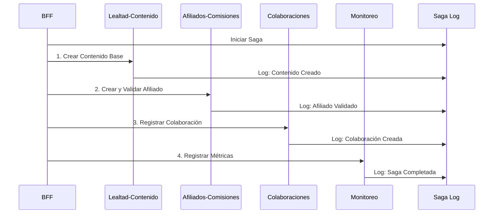

# 🎯 BFF CSaaS - Patrón Saga Implementation

## 📋 Descripción del Proyecto

Este proyecto implementa un **Backend for Frontend (BFF)** con el patrón **Saga** para manejar transacciones distribuidas en una plataforma **Content as a Service (CSaaS)**. El sistema orquesta múltiples microservicios para completar el registro de afiliados con contenido usando compensaciones automáticas.

## 🏗️ Arquitectura del Sistema

### Microservicios Incluidos
- **🎨 Lealtad-Contenido**: Gestión de contenido y programas de lealtad
- **💰 Afiliados-Comisiones**: Manejo de afiliados y cálculo de comisiones  
- **🤝 Colaboraciones**: Gestión de colaboraciones entre creadores
- **Monitoreo**: Recolección y análisis de métricas del sistema
- **BFF-Service**: Backend for Frontend con orquestación de sagas

### Patrón Saga Implementado: "Registro Completo de Afiliado"



## Despliegue y Ejecución

### Prerrequisitos
- Docker y Docker Compose
- Python 3.11+
- Postman (para pruebas)

### 1. Levantar la Infraestructura

```bash
# Levantar todos los servicios
docker-compose --profile pulsar --profile bff up -d

# Verificar que todos los containers estén ejecutándose
docker-compose ps
```

### 2. Verificar Servicios

Los siguientes puertos estarán disponibles:
- **BFF Service**: http://localhost:8000
- **Afiliados-Comisiones**: http://localhost:8081  
- **Monitoreo**: http://localhost:8082
- **Colaboraciones**: http://localhost:8083
- **Pulsar Admin**: http://localhost:8080
- **PgAdmin**: http://localhost:5050

### 3. Health Checks

```bash
# Verificar BFF
curl http://localhost:8000/health

# Verificar estado de microservicios
curl http://localhost:8000/api/v1/services/status

# Verificar sistema de sagas
curl http://localhost:8000/api/v1/health/sagas
```

## Pruebas con Postman

### Importar Collection
1. Abrir Postman
2. Importar `BFF_CSaaS_Saga_Collection.postman_collection.json`
3. Configurar variable `bff_base_url` = `http://localhost:8000`

### Casos de Prueba Incluidos

#### 1. 🎯 Saga Principal
- **Iniciar Saga**: Registro completo de afiliado
- **Consultar Estado**: Monitoreo en tiempo real
- **Listar Sagas**: Ver historial de transacciones
- **Estadísticas**: Métricas generales del sistema

#### 2. Compensaciones y Debug
- **Forzar Compensación**: Para testing de fallos
- **Health Checks**: Verificación de servicios

#### 3. 💾 Casos de Prueba Específicos
- **Caso 1**: Saga exitosa completa
- **Caso 2**: Email duplicado (falla controlada)
- **Caso 3**: Tasa de comisión inválida

### Ejemplo de Request

```json
POST /api/v1/sagas/complete-affiliate-registration
{
  "affiliate_name": "Juan Pérez",
  "affiliate_email": "juan.perez@example.com", 
  "commission_rate": 0.15,
  "content_type": "BLOG",
  "content_title": "Guía de Marketing Digital",
  "content_description": "Guía completa sobre estrategias de marketing",
  "collaboration_type": "CONTENT_CREATION"
}
```

## Experimentos de Calidad

### Instalación de Dependencias

```bash
cd experiments
pip install aiohttp asyncio
```

### Ejecución de Experimentos

#### Todos los Experimentos
```bash
python run_all_experiments.py
```

#### Experimentos Individuales

1. **📈 Rendimiento**
```bash
python performance_experiment.py
```
- **Hipótesis**: 100 requests/min con <2seg latencia P95
- **Valida**: Throughput y latencias bajo carga

2. **Resiliencia**  
```bash
python resilience_experiment.py
```
- **Hipótesis**: 95% éxito normal, 80% recuperación de fallos
- **Valida**: Compensaciones automáticas y recuperación

3. **Observabilidad**
```bash  
python observability_experiment.py
```
- **Hipótesis**: Consultas <1seg, 95% trazabilidad completa
- **Valida**: Saga log y trazabilidad

### Archivos de Resultados

- `performance_experiment_results.json`
- `resilience_experiment_results.json`
- `observability_experiment_results.json`
- `experiments_summary.json`

## 🔍 Saga Log y Monitoreo

### Consultas SQL Directas

```sql
-- Conectar a la base de datos saga (puerto 5435)
-- Usuario: saga, Password: saga

-- Ver todas las sagas
SELECT id, saga_type, status, created_at, updated_at 
FROM saga_logs 
ORDER BY created_at DESC;

-- Ver pasos de una saga específica
SELECT id, saga_type, steps 
FROM saga_logs 
WHERE id = 'YOUR_SAGA_ID';

-- Estadísticas por estado
SELECT status, COUNT(*) as count 
FROM saga_logs 
GROUP BY status;

-- Sagas con compensaciones
SELECT * FROM saga_logs 
WHERE steps::text LIKE '%compensate%';
```

### Dashboard de Monitoreo

```bash
# Estadísticas generales
curl http://localhost:8000/api/v1/sagas/statistics

# Listar sagas recientes
curl "http://localhost:8000/api/v1/sagas?limit=10&status=COMPLETED"

# Estado detallado de saga
curl http://localhost:8000/api/v1/sagas/{SAGA_ID}/status
```

## 🎥 Para el Video de Demostración

### 1. Flujo Exitoso Completo
```bash
# 1. Mostrar servicios activos
docker-compose ps

# 2. Crear saga exitosa (Postman)
# 3. Monitorear progreso en tiempo real
# 4. Verificar en saga log (SQL)
```

### 2. Flujo con Compensación
```bash
# 1. Crear saga con email duplicado (Postman) 
# 2. Mostrar compensaciones en saga log
# 3. Verificar rollback en cada servicio
```

### 3. Experimentos de Calidad
```bash
# Ejecutar suite completa
cd experiments
python run_all_experiments.py

# Mostrar resultados y validación de hipótesis
```

## 🔧 Troubleshooting

### Problemas Comunes

1. **BFF no conecta a microservicios**
```bash
# Verificar que todos los containers estén en la misma red
docker network ls
docker network inspect misw4406_202514_alpes_partners_pulsar
```

2. **Base de datos saga no disponible**
```bash
# Verificar container de base de datos
docker-compose logs db-saga

# Conectar manualmente para verificar
docker exec -it db-saga psql -U saga -d saga
```

3. **Pulsar no disponible**
```bash
# Verificar broker de Pulsar
docker-compose logs broker

# Health check de Pulsar
curl http://localhost:8080/admin/v2/clusters
```

### Logs Útiles

```bash
# Logs del BFF
docker-compose logs bff-service

# Logs de un microservicio específico
docker-compose logs afiliados-comisiones

# Logs de Pulsar
docker-compose logs broker
```

## 📚 Documentación Adicional

### Principios DDD Aplicados

- **Bounded Contexts**: Cada microservicio representa un contexto acotado
- **Agregados**: Entidades principales con invariantes de negocio
- **Domain Events**: Comunicación entre contextos vía eventos
- **Repositories**: Patrón de acceso a datos por contexto
- **Command/Query Separation**: Separación clara de comandos y consultas

### Patrones Implementados

- **Saga Pattern**: Transacciones distribuidas con compensación
- **CQRS**: Separación de comandos y queries
- **Event Sourcing**: Log de eventos para trazabilidad 
- **Backend for Frontend**: API unificada para clientes
- **Circuit Breaker**: Resiliencia en comunicación entre servicios

### Calidad del Software

- **Rendimiento**: Throughput y latencias bajo carga
- **Resiliencia**: Manejo de fallos y recuperación automática  
- **Observabilidad**: Trazabilidad completa de transacciones
- **Mantenibilidad**: Código limpio y patrones establecidos

---

## 📞 Contacto y Soporte

Para preguntas sobre la implementación, revisar los logs detallados y la documentación de cada experimento en la carpeta `experiments/`.

**¡El sistema está listo para la demostración en video! 🎬**